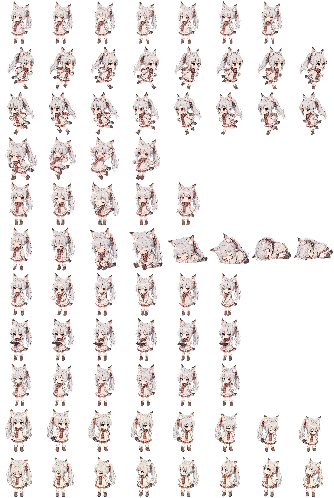

# Codex 宠物说明

## 1. Midex

**Midex** 是当前在 Codex 中启用的宠物。她是一位银白长发、红色眼睛的猫耳少女，佩戴粉棕色格纹围巾，身穿浅色裙装和短靴。她的性格傲娇可爱但可靠，是一位会直接指出问题的编程伙伴。

Midex 使用 Codex 宠物 v2 格式，图集尺寸为 `1536 × 2288`，包含待机、左右奔跑、挥手、跳跃、失败、等待、工作、检查等标准动画，以及 16 个观察方向。



## 2. Pixel Apple Cat

**Pixel Apple Cat** 是一只藏在红色像素苹果里的猫咪宠物。它保留了黑色苹果梗、像素描边、小手和小脚，并拥有待机、奔跑、挥手、跳跃、失败、等待、工作、检查等标准动画。

最新版使用 Codex 宠物 v2 格式，并包含顺时针排列的 16 个观察方向。


## 3. 将宠物压缩、打包并安装到 Codex

### 3.1 准备宠物目录

每只宠物使用一个独立文件夹，至少包含以下两个文件：

```text
midex/
├── pet.json
└── spritesheet.webp
```

- `pet.json`：宠物的 ID、显示名称、描述、精灵版本和图片路径。
- `spritesheet.webp`：宠物动画图集。
- v2 宠物图集通常为 `1536 × 2288`，由 8 列、11 行、每格 `192 × 208` 的动画单元组成。

### 3.2 编写 pet.json

v2 宠物的 `pet.json` 可以采用以下格式：

```json
{
  "id": "midex",
  "displayName": "Midex",
  "description": "Midex 的宠物简介。",
  "spriteVersionNumber": 2,
  "spritesheetPath": "spritesheet.webp"
}
```

### 3.3 压缩宠物包

在 PowerShell 中进入宠物文件夹的上一级目录，然后运行：

```powershell
Compress-Archive -LiteralPath ".\midex" -DestinationPath ".\midex.zip" -Force
```

### 3.4 安装到 Codex

将完整宠物文件夹复制到：

```text
%CODEX_HOME%\pets\<pet-id>\
```

例如，当 `CODEX_HOME` 为 `E:\codex` 时：

```text
E:\codex\pets\midex\
├── pet.json
└── spritesheet.webp
```

也可以直接用 PowerShell 解压安装：

```powershell
Expand-Archive -LiteralPath ".\midex.zip" -DestinationPath "$env:CODEX_HOME\pets" -Force
```

### 3.5 安装后检查

安装完成后请确认：

1. 宠物目录中同时存在 `pet.json` 和 `spritesheet.webp`。
2. `pet.json` 中的 `id` 与宠物文件夹用途一致。
3. v2 宠物包含 `"spriteVersionNumber": 2`。
4. 图集尺寸和动画行数正确。
5. 重启或重新加载 Codex 后，宠物可以被识别并正常播放动画。
